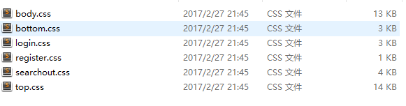

# HTML CSS JavaScript的性能优化

### 写在前面：迎新网因为我给首页加的特技把首页卡了个爽，所以我决定去看看先性能优化，也和大家分享一下看到的学到的还有个人经验


## 渲染引擎的主要工作流程


Translate：解析ＨＴＭＬ构建ＤＯＭ树→ 渲染树构建→ 渲染树布局→ 绘制渲染树

**Dom树的解析和构建**

渲染引擎会解析ＨＴＭＬ文档并把标签转换成内容树中的ＤＯＭ节点

**渲染树构建**

此时是渲染引擎会解析style元素和外部文件中的样式数据。样式数据和HTML中的显示控制将共同用来创建渲染树

渲染树包含带有颜色，尺寸等显示属性的矩形。这些矩形的顺序与显示顺序一致。

**渲染树布局**

渲染树构建完成后就是布局处理，也就是确定每个节点在屏幕上的确切显示位置。

**绘制**

 遍历渲染树并用UI后端层将每一个节点绘制出来。


**从这里，我们可以大概地知道在暂且不论JavaScript的情况下，优化能从哪里入手**

**首当其冲是dom树**，dom结构的减少可以直接减少需要解析、构建、渲染的元素数量，这是从根本上在给渲染引擎减轻负担

值得一提的是

* 渲染引擎不会等到HTML被解析完才开始渲染，浏览器会尽快显示所有内容。
* 有些不符合规范的嵌套顺序、标签缺失、非法标签等浏览器虽能正常显示，但是引擎耗费了时间去修正错误
* 一些不要但是你按完Tab就自己加上去的属性要删了，这些属性仍会被解析
* iframe虽然用起来很爽，但是大一点的网站这个东西还是有点拖加载

**其次是渲染页面**
渲染页面我们借助CSS来实现
容易忘记的是CSS选择器的查找是从右往左查找，所以在大型网站上我们都能发现需要稍复杂样式的标签几乎都有一个class，不会去使用多级嵌套如

``.xxx .xxxx p{xxxxxx}``

而是直接给最深的dom一个class

``.thisisP{xxxxx}``

多级嵌套样式的优先级也会比直接一个class高，出于对可维护性的考虑低优先级的选择器自然是先用

同时**不要使用@import**“@import一时爽，加载火葬场”实践证明它会拖慢加载

通配符*也会遍历整个dom树去添加样式，一样的恐怖

 **display的规则也很容易搞不清楚**

由于display的作用，某些样式组合会无效，徒增样式体积的同时也影响解析性能。CSS Lint会检查一下几点： 
display:inline后不应该再使用width、height、margin、padding以及float。 
display:inline-block后不应该再使用float。 
display:block后不应该再使用vertical-align。 
display:table-*后不应该再使用margin或者float。 

**可以继承的样式在子元素那里就不用再写了**

比如color，font-size，font-family

**雪碧图！**

墙裂安利雪碧图！在处理视觉小姐姐给的打堆的图片和小icon的时候，在CSS里一个个写真的是太可怕了（到底哪张图才是这个位置的呢？到底要怎么对这些图片命名？），切过b站的都知道这恐怖。而且为了这一个小icon去发一个请求下载图片真的亏成一匹马。不如做成雪碧图，一个background-posistion就可以准确定位，还能减少CSS体积，统一一个class来写backgroundimage。总之，雪碧图可以有效减少请求数量，大大简化CSS编写工作，甚至还能配合js实现意想不到的效果


这是迎新网我做的一个计时器雪碧图，配合transition和js实现了计时器滑动效果，逼格++

b站用得更妙


直接拿来做动画了

**CSS的可维护性**

> 程序员眼里别人写的代码都是屎。 --秋香

你看不懂别人的代码当然觉得他写的是一坨屎了，其实人家写得可能没有你被恶心完了以后觉得的那么差

* **命名**

多人合作时这个是最重要的，写个猎奇class名字在上面人家根本不知道你这里是什么

我自己用的是 内容-功能 有时会 主内容-副内容-功能 

比如我要写个div装我的轮播最暴力的命名就是 “lunbo-wrapper”

里头放要轮播的图片就写个”lunbo-container“

最好使用英文来命名，这样就算不约定怎么写class名，别人都能看懂你的CSS，进而维护

**BEM命名将其提炼了出来作为一个方法论**

 weui.IO

BEM是Block，Element，Modifier的缩写。

　　(1)Block：在BEM的理论中，一个网页是由block组成的，比如头部是个block，内容是block，logo也是block，一个block可能由几个子block组成。

　　(2)Element：element是block的一部分，具有某种功能，element依赖于block，比如在logo中，img是logo的一个element，在菜单中，菜单项是菜单的一个element

　　(3)Modifier：modifier是用来修饰block或者element的，它表示block或者element在外观或行为上的改变

　　我们通过BEM命名法写样式如下：

　　.block{}

　　.block-element{}

　　.block-modifier{}

　　.block-element-modifier{}

　　BEM将页面解析为block和element，然后根据不同的状态使用modifier来设置样式。

* 重复样式最好提取出来

这一个方法很容易理解，简单说就是提取相同的样式成为一个单独的类再引用，这样不仅可以精简CSS文件大小，而且CSS代码变少，更易于重用和维护。

* 书写顺序

推荐一个网站，有规范的书写顺序，别人更好找你的代码，简单的在这里

​	(1)位置属性(position, top, right, z-index, display, float等)

　　(2)大小(width, height, padding, margin)

　　(3)文字系列(font, line-height, letter-spacing, color- text-align等)

　　(4)背景(background, border等)

　　(5)其他(animation, transition等)

http://www.shejidaren.com/css-written-specifications.html#0-sqq-1-82555-9737f6f9e09dfaf5d3fd14d775bfee85

* SMACSS

  这套方法论很符合我对编写CSS的理解，我平时也是这样做的

  　　SMACSS是可扩展和模块化的CSS架构。

  　　SMACSS将样式分成5种类型：Base，Layout，Module，State，Theme。

  　　1、Base

  　　基础样式表，定义了基本的样式，我们平时写CSS比如reset.css就是属于基础样式表，另外我认为清除浮动，一些动画也可以归类为基础样式。

  　　2、Layout

  　　布局样式，用于实现网页的基本布局，搭起整个网页的基本骨架。

  　　3、Module

  　　网页中不同的区域有这个不同的功能，这些功能是相对独立的，我们可以称其为模块。模块是独立的，可重用的组件，它们不依赖于布局组件，可以安全的删除修改而不影响其他模块。

  　　4、State

  　　状态样式，通常和js一起配合使用，表示某个组件或功能不同的状态，比如菜单选中状态，按钮不可用状态等。

  　　5、Theme

  　　皮肤样式，对于可更换皮肤的站点来说，这个是很有必要的，分离了结构和皮肤，根据不同的皮肤应用不同的样式文件。

  举个例子，在寒假仿b站的时候我的css是这样的

  

不同的模块写在不同的css里虽然是很基础的SMACSS套路，但是改起来就不用翻个几百行去找了

## JavaScript性能优化

* 注意作用域

  js的变量可以分为全局变量和局部变量

  var 可以定义函数作用域变量

  let 可以定义块级作用域变量

  根据ECS栈的原理，在一个函数被推入栈的时候查找其上下文是最快的，可以在函数内复制要用到的全局变量，这样只需要查询一次，而不是多次

* 避免多个变量声明

```javascript
var a,
    b,
    c;
比
var a;
var b;
var c;
效率要高得多
```

* 避免非必要地使用构造函数

```javascript
例如对象就直接（JSON大法好）
var human ={
  name："Van",
  job:"artist"
}
no
var human = new Obejct();
human.name = "Van"···········
```

* 尽量少操作Dom

  我们都知道Dom操作是js里面最拖性能的操作了，每次改变Dom，浏览器都要对改变完的内容重新进行一次渲染

  tranfrom taslated

  ​

  如果是动画效果，那就更惨了（指自己）

  我就是个反面例子，布局没仔细看，把充满了整个首页内容的div做成了一个上移动画，卡成什么样你们也看到了

踩完坑以后我有几个方法可以用来优化dom操作

1.改变样式的dom操作尽量在css里写个class然后通过js改变class，这样只需要一次操作和一次重渲染，而不是用js改变多个样式，每改一个都要重启渲染过程;

2.在dom树最深处操作dom

​	既然只要dom操作都会重渲染，不如减少其面积，只操作必要的dom，在布局的时候这个要需要考虑进去，哪怕dom树写深一点，总比js不得不操作一大堆dom结构来的快

3.合理使用innerHTML

​	在用ajax获取数据之后，我们常需要动态创建dom元素把内容放进去，诸如createElement(),appendChild()这样的函数会被大量的使用，然后再一股脑全部注入目标容器。这些dom元素结构都是预先想好的，样式也应该不由dom来操作而是通过CSS的class，那么不如用innerHTML把这些元素节点全都写进去，由于内部方法是编译好的而非解释执行，故执行的更快。

*  对字符串进行循环操作，例如替换、查找，就使用正则 

  因为JS的循环速度比较慢，而正则表达式的操作是用C写成的API，性能比较好。


* 慎用eval()

  不是说不能用，eval函数确实功能强大，但是不用在必要的地方还是会拖性能，不懂就不要用了，反正我不管我不懂我不用(菜鸟三连)

* ajax性能优化

  虽然是异步操作，但是还是在用的时候慢了还是十分影响体验的，我现在懂的就是尽量减少请求次数，项目搞大了怕后端来打我们

* 不要学我写垃圾代码

  这其实就不是技术的问题了，是心态的问题，写翻车了还是要想一个好一点的解决方案，放弃治疗代码肯定性能差，还恶心维护人员

  ​