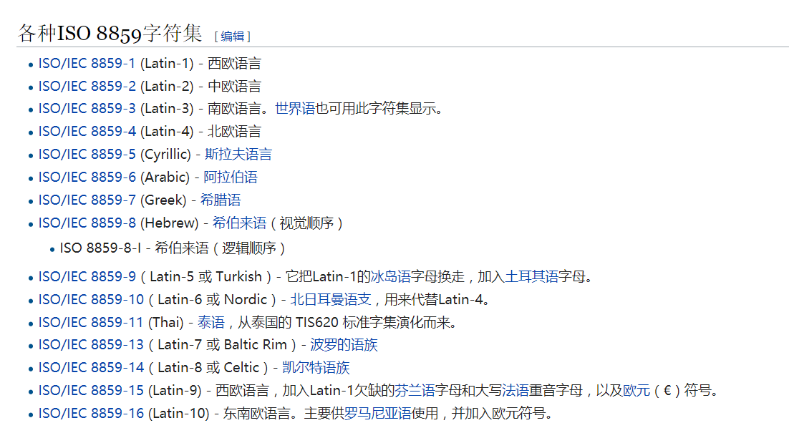

# 课件

## 编码，字符集和编码方式的区别


首先要知道，**计算机中数据的存储和运输都是二进制的形式。**


**ASCII**：以前美国人的编码方式，因为字符少，所有字符共计128个，都用1个字节的后7位的表示。

ASCII其实就是**字符**和**字节序**的一个**一一映射**关系。


**ISO-8859-n**： 欧洲一些国家字符要多一些，所以在ASCII的基础上进行了拓展，也就是利用到了ASCII中没用到的最高位字节



**gbk/gb2312** 中国大陆的编码方式，在兼容ASCII的基础上，一个字符由多个字节来表示。


总的来说，以上几种编码方式，都是一个字符和一个字节序（数据在计算机中的存储）的映射关系。


### Unicode是字符集，UTF-8/16/32是编码方式


多种编码方式很混乱，所以就推出了unicode。

一个字符对应一个码点（codepoint），一个码点根据不同的编码方式就对应了不同的字节序。

上课我已经讲了，具体是如何编码可以参考下面链接

相关链接：

[Unicode与JavaScript详解](http://link.zhihu.com/?target=http%3A//www.ruanyifeng.com/blog/2014/12/unicode.html)

[浅谈前端的 Unicode](http://link.zhihu.com/?target=https%3A//www.zeroling.com/qian-tan-qian-duan-de-unicode/)

[字符编码笔记：ASCII，Unicode和UTF-8](http://www.ruanyifeng.com/blog/2007/10/ascii_unicode_and_utf-8.html)


### Buffer


字符 '你' 对应的UTF-8转化成的字节序是 e4 bd a0

而buffer中可以看出'你'也对应着e4 bd a0。

所以buffer对应着什么就不用解释了吧？


buffer的拼接

```
//不应该用这种方法，这只是用来举个例子
//即无法有效读取二进制，对于多字节的字符，也可能出乱码
var segment = ''
req.on('data', (chunk) => {
    segment += chunk
})
req.on('end', () => {
    console.log(segment)
})

//推荐
//可以用来上传图片/视频
var segment = []
req.on('data', (chunk) => {
    segment.push(chunk)
})
req.on('end', () => {
	segment = Buffer.concat(segment)
    console.log(segment)
})
```


### http

当我们读取html文件所对应的二进制字节，并放到响应的实体部分，发送到前端，前端是怎么判断编码方式以及如何渲染呢？

**编码：** 根据'Content-Type': 'text/plain;charset=utf-8'这个相应头中的charset进行解码，如果响应头没有charset，那么浏览器会先用ASCII对字节序进行解码，等读取到文件中的<meta charset='utf-8'>，再重新使用utf-8进行解码。如果响应头和meta标签中都没有申明charset，那自然会乱码


**渲染：** 根据响应头进行渲染，如text/html则渲染成页面，text/plain渲染成文本


### express

[阮一峰express](http://javascript.ruanyifeng.com/nodejs/express.html)

[express官网](https://expressjs.com/en/api.html)

express主要还是对于http.createServer这个函数的那个参数函数的一个封装，从源码就可以看出来。

express最主要是概念应该是中间件，app.use用来注册中间件，可以看下阮老师的教程。


#### module.exports 与 exports

**require函数可以看成什么？**

```
//index.js
var a = {
  name: 'xiaoA'
}
```

```
var x = require('index.js')
```

等价于

```
var x = function () {
  	var a = {
        name: 'xiaoA'
      }
    return module.exports
}()
```


那么module.exports和exports有什么关系？

其实就一个关系，这**两个变量保存的地址开始是相同的**，**指向同一块堆内存**。

如果给exports赋值，如

```
exports = {
    id : '1',
    val : 'q'
}
```


那么exports就不再指向module.exports，然而require函数其实返回的是module.exports，所以说不要直接给exports赋值。

