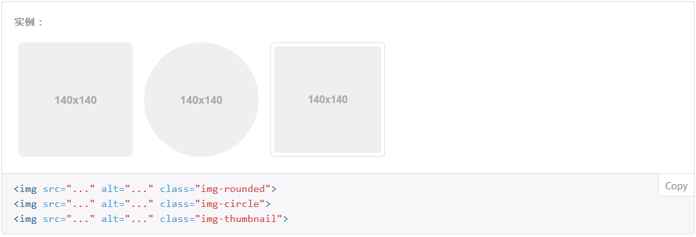

# Bootstrap

* Bootstrap，来自 Twitter，是目前最受欢迎的前端框架。Bootstrap 是基于 HTML、CSS、JAVASCRIPT 的，它简洁灵活，使得 Web 开发更加快捷。
* 我们可以直接使用 Bootstrap 提供的 CSS 样式表，同时Bootstrap 的源码是基于最流行的 CSS 预处理脚本 - [Less](http://v3.bootcss.com/css/#less) 和 [Sass](http://v3.bootcss.com/css/#sass) 开发的。我们可以采用预编译的 CSS 文件快速开发，也可以从源码定制自己需要的样式。
* 我们的网站和应用能在 Bootstrap 的帮助下通过同一份代码快速、有效适配手机、平板、PC 设备，这一切都是 CSS 媒体查询（Media Query）的功劳。
* [Bootstrap][http://v3.bootcss.com/] 官网提供了全面、美观的文档。在这里可以找到关于 HTML 元素、HTML 和 CSS 组件、jQuery 插件方面的所有详细文档。
* Bootstrap目前有1.0,2.0,3.0,4.0四个版本，但是3.0是稳定版，所以通常我们学习过程中可以去看3.0的文档，引用bootstrap文件时也引用3.0版本的文件。    PS：目前最新版是v3.3.7。


## Bootstrap 文件目录

``` 
├── css/	 <!--CSS样式文件-->
│ ├── bootstrap.css 	<!--Bootstrap核心CSS文件-->
│ ├── bootstrap.css.map 	<!--source map文件-->
│ ├── bootstrap.min.css 	<!--Bootstrap核心CSS文件 压缩版-->
│ ├── bootstrap.min.css.map
│ ├── bootstrap-theme.css	 <!--可选的Bootstrap主题文件（一般不用引入）-->
│ ├── bootstrap-theme.css.map
│ ├── bootstrap-theme.min.css	 <!--可选的Bootstrap主题文件（一般不用引入） 压缩版-->
│ └── bootstrap-theme.min.css.map
├── js/ 	<!--JavaScript文件-->
│ ├── bootstrap.js 	<!--Bootstrap核心JavaScript文件-->
│ └── bootstrap.min.js	 <!--Bootstrap核心JavaScript文件 压缩版-->
└── fonts/ 	<!--字体图标-->
 ├── glyphicons-halflings-regular.eot
 ├── glyphicons-halflings-regular.svg
 ├── glyphicons-halflings-regular.ttf
 ├── glyphicons-halflings-regular.woff
 └── glyphicons-halflings-regular.woff2
```

*bootstrap.min.css、jquery.min.js、bootstrap.min.js这三个文件的引入顺序一定不能错乱，一般把jquery.min.js、bootstrap.min.js这两个文件放入HTML网页的最底部，这么做是为了防止网页未加载完毕而这两个文件先加载可能产生的不必要的问题。* 

当然不下载则也可以引用：

``` 
<!-- 最新版本的 Bootstrap 核心 CSS 文件 -->
<link rel="stylesheet" href="https://cdn.bootcss.com/bootstrap/3.3.7/css/bootstrap.min.css" integrity="sha384-BVYiiSIFeK1dGmJRAkycuHAHRg32OmUcww7on3RYdg4Va+PmSTsz/K68vbdEjh4u" crossorigin="anonymous">

<!-- 可选的 Bootstrap 主题文件（一般不用引入） -->
<link rel="stylesheet" href="https://cdn.bootcss.com/bootstrap/3.3.7/css/bootstrap-theme.min.css" integrity="sha384-rHyoN1iRsVXV4nD0JutlnGaslCJuC7uwjduW9SVrLvRYooPp2bWYgmgJQIXwl/Sp" crossorigin="anonymous">

<!-- 最新的 Bootstrap 核心 JavaScript 文件 -->
<script src="https://cdn.bootcss.com/bootstrap/3.3.7/js/bootstrap.min.js" integrity="sha384-Tc5IQib027qvyjSMfHjOMaLkfuWVxZxUPnCJA7l2mCWNIpG9mGCD8wGNIcPD7Txa" crossorigin="anonymous"></script>
```

*我们可爱的[官网][http://v3.bootcss.com/getting-started/#download] 还提供了很多办法！！！*


##  Bootstrap 栅格系统

Bootstrap 提供了一套响应式、移动设备优先的流式网格系统，随着屏幕或视口（viewport）尺寸的增加，系统会自动分为最多*12* 列。


bootstrap把根据屏幕大小把屏幕分为了4个层级，小于768像素的为超小屏幕，大于等于768像素的为小屏幕，大于等于992像素的为中等屏幕，大于等于1200像素的则为大屏幕，相应的类前缀见图或查看官方文档，根据栅格参数，我们看下下面这幅图：


每行的数字全部相加，最终都等于12！！


## Bootstrap 表格

``` 
<div class="container">
    <table class="table table-striped table-bordered table-hover">
        <thead>
            <tr>
                <td>标题1</td>
                <td>标题2</td>
                <td>标题3</td>
                <td>标题4</td>
            </tr>
        </thead>
        <tbody>
            <tr>
                <td>内容1a</td>
                <td>内容2a</td>
                <td>内容3a</td>
                <td>内容4a</td>
            </tr>
            <tr>
                <td>内容1b</td>
                <td>内容2b</td>
                <td>内容3b</td>
                <td>内容4b</td>
            </tr>
            <tr>                
                <td>内容1c</td>
                <td>内容2c</td>
                <td>内容3c</td>
                <td>内容4c</td>
            </tr>
            <tr>
                <td>内容1d</td>
                <td>内容2d</td>
                <td>内容3d</td>
                <td>内容4d</td>
            </tr>
            <tr>
                <td>内容1e</td>
                <td>内容2e</td>
                <td>内容3e</td>
                <td>内容4e</td>
            </tr>
        </tbody>
    </table>
</div>
```

1. table ：赋予基本的样式 — 少量的内补（padding）和水平方向的分隔线，并且会让表格宽度变为100%

2. table-striped ：给表格添加“斑马线”效果

3. table-bordered ：为表格和其中的每个单元格增加边框

4. table-hover ：可以让 `<tbody>` 中的每一行对鼠标悬停状态作出响应

5. 通过这些状态类可以为行或单元格设置颜色。

   | Class      | 描述                 |
   | ---------- | ------------------ |
   | `.active`  | 鼠标悬停在行或单元格上时所设置的颜色 |
   | `.success` | 标识成功或积极的动作         |
   | `.info`    | 标识普通的提示信息或动作       |
   | `.warning` | 标识警告或需要用户注意        |
   | `.danger`  | 标识危险或潜在的带来负面影响的动作  |


## [Bootstrap 排版][http://v3.bootcss.com/css/#type]

这个知识点太杂了而且感觉讲起来很无聊……略过略过，大家自己看一遍就会了（虽然上面的也是看一遍就会了，但排版真的很无聊啊！）


## Bootstrap 按钮 

#### 针对组件的注意事项：

虽然按钮类可以应用到 `<a>` 和 `<button>` 元素上，但是，导航和导航条组件只支持 `<button>` 元素。

#### 链接被作为按钮使用时的注意事项

如果 `<a>` 元素被作为按钮使用 -- 并用于在当前页面触发某些功能 -- 而不是用于链接其他页面或链接当前页面中的其他部分，那么，务必为其设置 `role="button"` 属性。

你们需要让按钮具有不同尺寸吗？？？？使用 `.btn-lg`、`.btn-sm` 或 `.btn-xs` 就可以获得不同尺寸的按钮。


## Bootstrap 图片




## Bootstrap 响应式工具

## 可用的类

通过单独或联合使用以下列出的类，可以针对不同屏幕尺寸隐藏或显示页面内容。

|                 | 超小屏幕            手机 (<768px) | 小屏幕            平板 (≥768px) | 中等屏幕            桌面 (≥992px) | 大屏幕            桌面 (≥1200px) |
| --------------- | --------------------------- | -------------------------- | --------------------------- | --------------------------- |
| `.visible-xs-*` | 可见                          | 隐藏                         | 隐藏                          | 隐藏                          |
| `.visible-sm-*` | 隐藏                          | 可见                         | 隐藏                          | 隐藏                          |
| `.visible-md-*` | 隐藏                          | 隐藏                         | 可见                          | 隐藏                          |
| `.visible-lg-*` | 隐藏                          | 隐藏                         | 隐藏                          | 可见                          |
| `.hidden-xs`    | 隐藏                          | 可见                         | 可见                          | 可见                          |
| `.hidden-sm`    | 可见                          | 隐藏                         | 可见                          | 可见                          |
| `.hidden-md`    | 可见                          | 可见                         | 隐藏                          | 可见                          |
| `.hidden-lg`    | 可见                          | 可见                         | 可见                          | 隐藏                          |

*的内容可以填写css中的display的各种值，如block,inline-block,inline吧啦吧啦……，这样顺便设置了display值！是不是很有意思啊