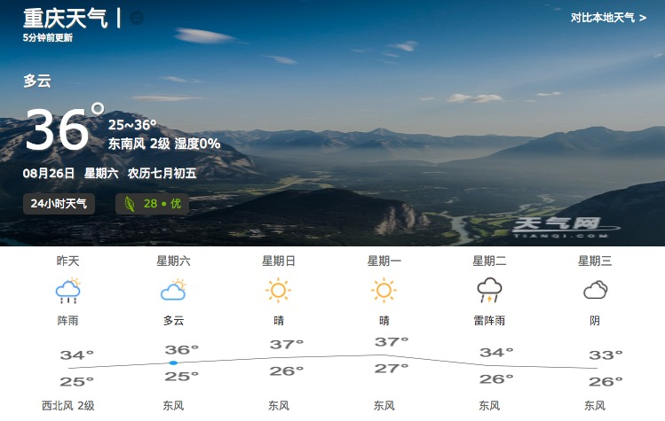

## 考核
+ node.js + 移动端, 写一个**七天**的天气预报, 至少完成这个页面 (但是这样好丑哦) 

+ 后端用 node.js 写 API, 前端渲染数据
+ 界面自己想，可参考各个网站 或者 hhh.png
+ 不能后端渲染

#### 必看
+ 27 号中午 12 点之前把 GitHub 地址发给我
+ 我 28 号开始看考核作业， git 最后一次提交时间超过 27 号 24 点的，我会直接 reset 到 27 号 24 点之前那个版本
+ .gitignore 必有
+ READMD 里面写如何运行你的代码
+ 代码规范: 命名，缩进，空格

#### 后端
+ 可用任何框架
+ 主要数据从 forecast.sql 来
+ 其余数据可自己想像
+ API 遵循 RESTFUl 规范

#### 前端
+ le ss 或者 sass
+ 原生 js, 不准用任何框架和库
+ 小图标用你喜欢的优化方式 (iconfont, sprite, base64)
+ es6
+ js 用 babel 转码
+ gulp 或者 webpack
+ canvas 画曲线
+ 手机和PC都能看, 像 [这样](https://m.tianqi.com/)

